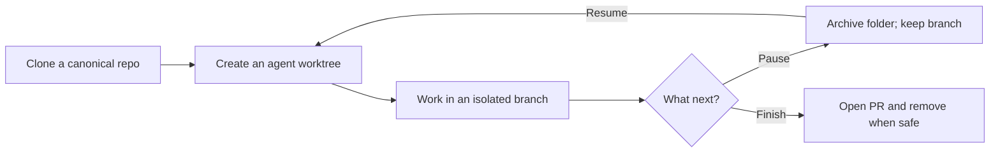
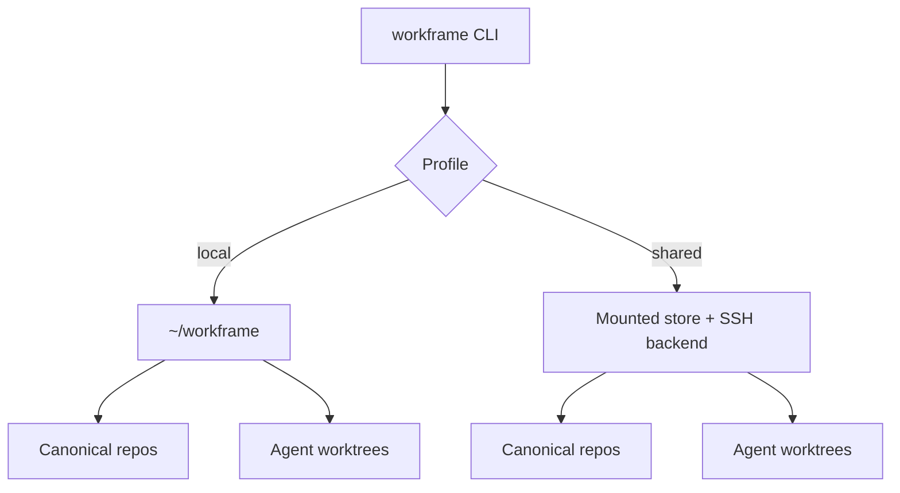

# Workframe

**A control plane for isolated agent worktrees.**

Workframe turns each piece of work into a dedicated Git worktree, branch, and
folder. Agents can work in parallel without sharing uncommitted state, while
every repository keeps one canonical clone.

```text
one canonical clone
├── codex/payment-retry  → workspaces/codex/api/oslo
├── claude/docs-refresh  → workspaces/claude/api/kyoto
└── cursor/cache-fix     → workspaces/cursor/api/dakar
```

Workframe 1.5.0 is a clean-start release. The command is `workframe`, product
environment variables use `WORKFRAME_*`, and local state begins at
`~/workframe`.

## Start in 60 seconds

Requirements: Bash, Git, and macOS or Linux. `gum` is optional.

```bash
git clone https://github.com/fschrhunt/workframe.git
cd workframe
./install.sh

workframe init
workframe agents add codex
workframe clone owner/repo
workframe new repo fix-login --agent codex
workframe list
```

Open the new workspace:

```bash
workframe ide repo/fix-login
```

When the work is parked:

```bash
workframe archive repo/fix-login --yes
workframe restore repo codex/fix-login
```

## The lifecycle



Workframe separates reversible lifecycle actions from destructive ones:

| Intent | Command | Result |
|---|---|---|
| Start | `workframe new repo feature --agent codex` | Creates a branch and worktree |
| Inspect | `workframe list` | Shows active worktrees |
| Pause | `workframe archive <selector> --yes` | Removes the folder, keeps the branch |
| Resume | `workframe restore repo agent/feature` | Recreates the worktree |
| Delete branch | `workframe remove branch repo agent/feature --yes` | Permanently deletes an archived branch |
| Delete repo | `workframe remove repo repo --yes` | Deletes the canonical clone when safe |

## Local or shared



- **Local** is the default. Commands operate directly on `~/workframe`.
- **Shared** keeps the store on a remote box and exposes worktrees through a
  mounted path. Connection details live in `~/workframe/config`, never in the
  repository.

Run `workframe init --shared` to configure a shared profile.

## Find the right guide

| I want to… | Read |
|---|---|
| Install and create my first workspace | [Getting started](docs/getting-started.md) |
| Understand the store and branch model | [Core concepts](docs/concepts.md) |
| Start, pause, resume, or remove work | [Workspace lifecycle](docs/guides/workspace-lifecycle.md) |
| Choose local or shared operation | [Profiles](docs/guides/profiles.md) |
| Configure agents and editors | [Agents and editors](docs/guides/agents-and-editors.md) |
| Look up a command | [CLI reference](docs/reference/cli.md) |
| Look up configuration or environment variables | [Configuration reference](docs/reference/configuration.md) |
| Diagnose a problem | [Troubleshooting](docs/troubleshooting.md) |
| Operate or release Workframe | [Operations](docs/operations.md) |
| Contribute safely | [Contributing](docs/contributing.md) |

The complete guided index lives in [the documentation library](docs/README.md).

## Develop

Workframe is a Bash CLI; there is no application server.

```bash
make check
bin/workframe help
```

`make check` runs ShellCheck and the hermetic Bats suite. Tests never require a
network connection, shared mount, remote box, or interactive terminal.

Read [AGENTS.md](AGENTS.md) before changing the product. Version: **1.5.0**.
