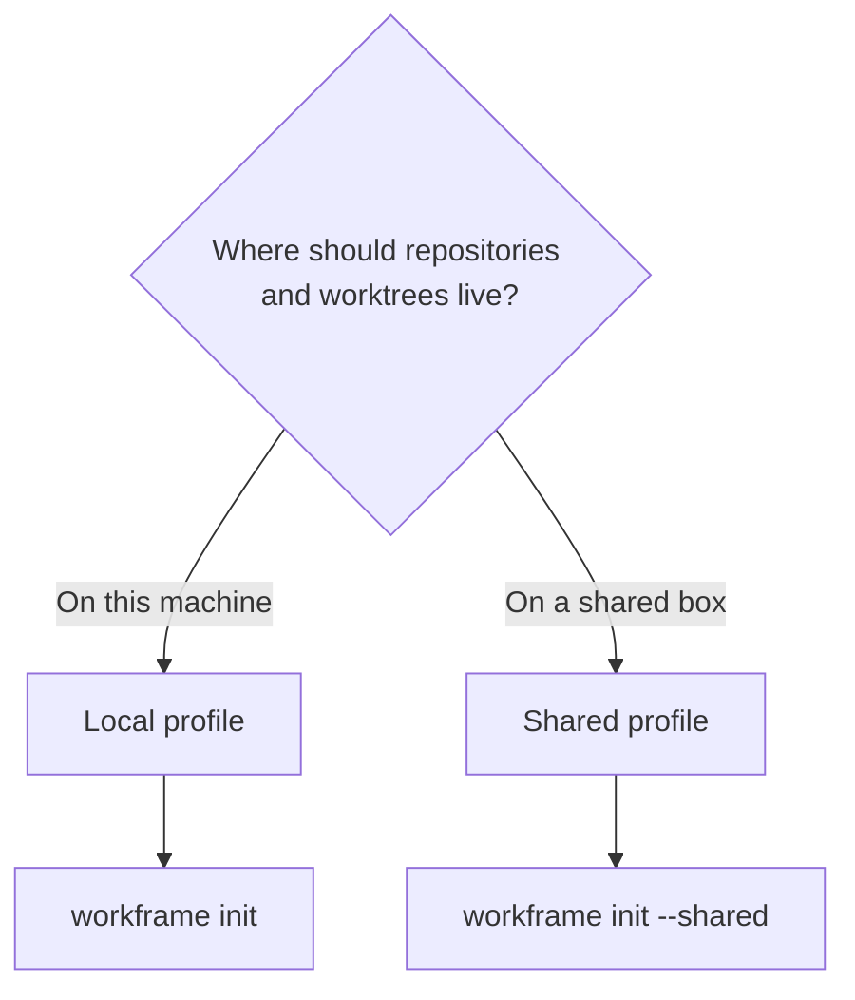

# Workframe documentation

Use this page as a guided starting point. Pick the outcome you want; each link
lands on the shortest path to it.

## What do you want to do?

| Goal | Start here |
|---|---|
| Install Workframe | [Install](getting-started.md#install) |
| Create the first local workspace | [First workspace](getting-started.md#create-your-first-workspace) |
| Connect a shared store | [Shared profile](guides/profiles.md#shared-profile) |
| Add or remove an agent identity | [Agents](guides/agents-and-editors.md#agent-identities) |
| Change the editor | [Editors](guides/agents-and-editors.md#editor) |
| Pause work without deleting its branch | [Archive](guides/workspace-lifecycle.md#archive-work) |
| Bring archived work back | [Restore](guides/workspace-lifecycle.md#restore-work) |
| Delete a branch or canonical repo | [Permanent removal](guides/workspace-lifecycle.md#permanent-removal) |
| Find a command or flag | [CLI reference](reference/cli.md) |
| Configure paths, profiles, or environment variables | [Configuration reference](reference/configuration.md) |
| Understand the on-disk layout | [Filesystem reference](reference/filesystem.md) |
| Fix a broken setup | [Troubleshooting](troubleshooting.md) |
| Operate a shared installation | [Operations](operations.md) |
| Change Workframe itself | [Contributing](contributing.md) |
| Follow the issue and PR workflow | [Linear and GitHub](linear.md) |

## Choose a profile

Use **local** unless multiple machines need the same canonical store. Local
mode has no SSH or mount dependency. Shared mode is useful when a team already
operates a secured box and mounted filesystem.

## Learn the model

1. [Core concepts](concepts.md) explains canonicals, worktrees, branches,
   selectors, agents, and profiles.
2. [Workspace lifecycle](guides/workspace-lifecycle.md) follows work from
   creation through archive, restore, and removal.
3. [CLI reference](reference/cli.md) documents every public command.
4. [Configuration reference](reference/configuration.md) documents every
   supported key and `WORKFRAME_*` control.

## Product and contributor docs

- [Root product overview](../README.md)
- [Operations and release safety](operations.md)
- [Contributor workflow](contributing.md)
- [Linear and GitHub contract](linear.md)
- [Workframe 1.5.0 release notes](releases/1.5.0.md)

All examples use generic repositories, accounts, hosts, and paths. Private
infrastructure values belong only in `~/workframe/config`.
